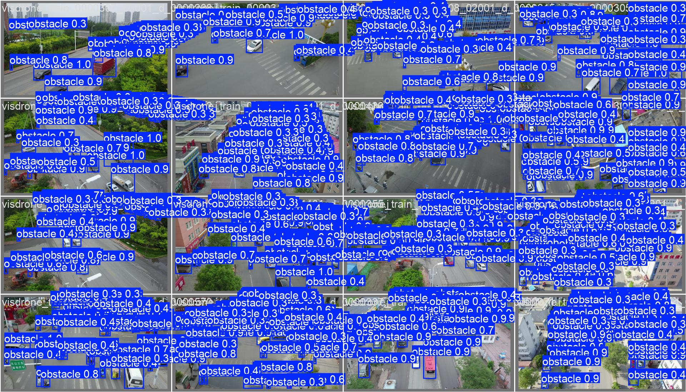
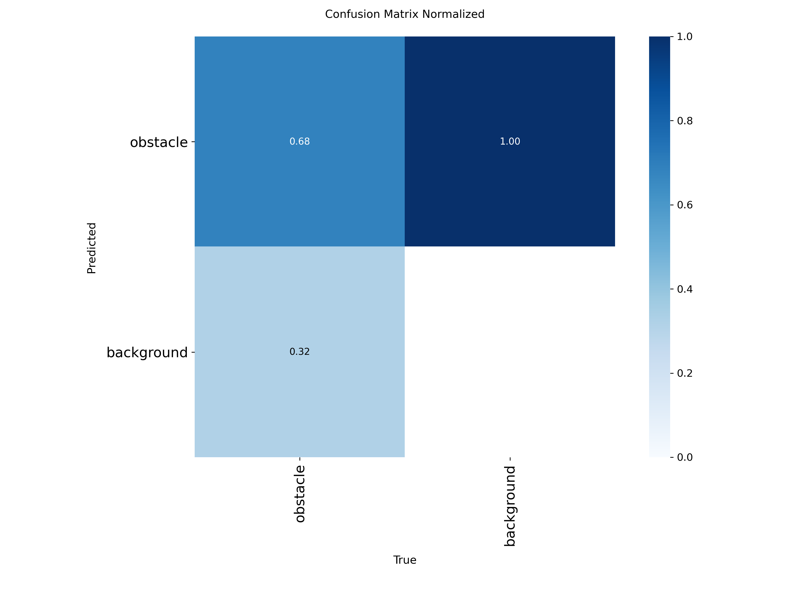
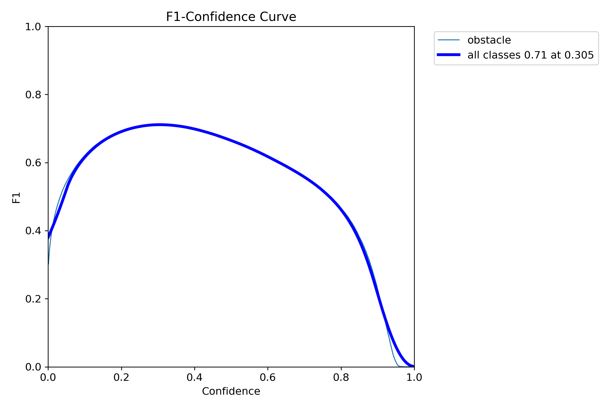
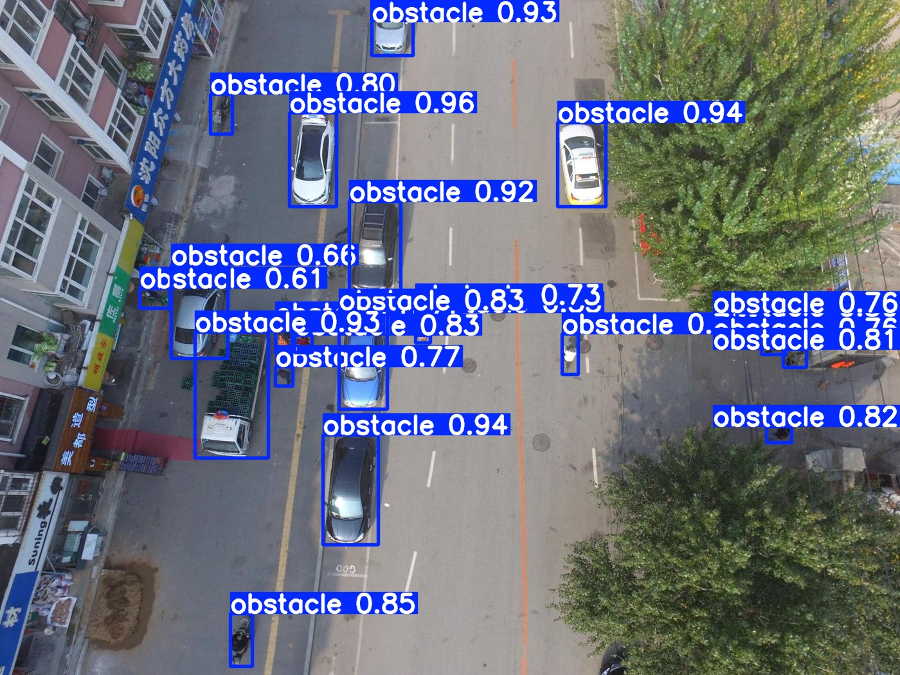

# yolo26-visdrone-detection

YOLO26 obstacle detection on aerial drone imagery. An end-to-end detection pipeline built with [Ultralytics YOLO26](https://docs.ultralytics.com/models/yolo26/): prepare a dataset from [VisDrone2019-DET](https://github.com/VisDrone/VisDrone-Dataset) (and real flight videos), train a single-class `obstacle` detector, validate, predict, and export to ONNX.

> Coursework experiments 5 & 6 for an embedded systems design course. The original step-by-step lab manual (Chinese) is kept in [`docs/LAB_MANUAL_CN.md`](docs/LAB_MANUAL_CN.md).

## Pipeline

```
scripts/00_smoke_test_yolo26.py        # sanity-check the YOLO26 environment
scripts/05_prepare_visdrone_subset.py  # build data_raw/ from VisDrone subset
scripts/06_extract_real_video_frames.py# extract real flight video frames
scripts/01_split_yolo_dataset.py        # 80/20 train-val split -> my_data/
scripts/02_make_data_yaml.py            # generate local dataset YAML (absolute path)
scripts/03_train_yolo26.py              # train YOLO26m
scripts/04_exp6_val_predict_export.py   # validate, predict, export ONNX
```

## Dataset

Single class: `obstacle`. Source images come from:

- **VisDrone2019-DET** — aerial object detection benchmark (train/val subsets), prepared by `05_prepare_visdrone_subset.py`.
- **Real flight videos** — frames extracted by `06_extract_real_video_frames.py` to close the sim-to-real gap.

Raw and prepared data (`data_raw/`, `external/`, `my_data/`) are not committed — download VisDrone and re-run the scripts to regenerate them.

## Getting started

```bash
conda create -n yolo26 python=3.10 -y
conda activate yolo26
pip install -r requirements_yolo26.txt
```

```bash
python scripts/00_smoke_test_yolo26.py        # download yolo26m.pt + bus.jpg, run a prediction
python scripts/01_split_yolo_dataset.py        # split data_raw/ into train/val
python scripts/02_make_data_yaml.py            # write configs/my_detect.local.yaml
python scripts/03_train_yolo26.py --device 0   # train (GPU) or --device cpu
python scripts/04_exp6_val_predict_export.py   # validate + predict + export ONNX
```

All checkpoints, predictions, and metrics are written under `runs/`.

## Results

Validation batch predictions and metrics from the trained YOLO26m:

| Validation predictions | Confusion matrix | F1 curve |
|---|---|---|
|  |  |  |

Inference on test images:

| Predict 1 | Predict 2 |
|---|---|
|  |  |

## Requirements

`ultralytics`, `torch`, `onnx`, `netron` — see [`requirements_yolo26.txt`](requirements_yolo26.txt).

## Repository layout

```
├── assets/            # sample image + result figures used in README
├── configs/           # dataset YAML templates + classes.txt
├── docs/              # lab manual and dataset notes (Chinese)
├── scripts/           # numbered pipeline scripts 00-06
├── requirements_yolo26.txt
└── .gitignore
```

Generated artifacts (`data_raw/`, `external/`, `my_data/`, `runs/`, `detect_test/`, `screenshots/`, `*.pt`, `*.onnx`) are git-ignored.
